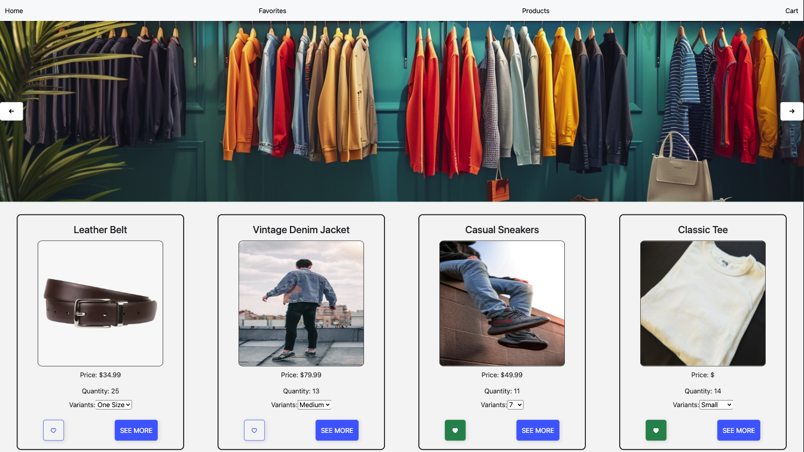

# REACT E-COMMERCE STORE

## Project Overview
This project showcases a fully functional e-commerce website using React, designed to enhance my understanding and skills in web development. It leverages Firestore for data management and react-router-dom for seamless navigation.

## Deployment Link
This e-shop is live! Check it out [here](#).

## Screenshot

## Table of Contents
- [Tech Stack](#tech-stack)
- [Goals](#goals)
- [How to use](#how-to-use)
- [Implementation](#implementation)
- [Code / Important Elements / Design Decisions](#code--important-elements--design-decisions)
- [Issues & Bugs](#issues--bugs)
- [Additions & Improvements](#additions--improvements)

## Tech Stack
- HTML
- CSS/SCSS
- JavaScript
- Git
- React
- React Router DOM
- Google Firestore

## Goals
The primary goal is to build a reactive e-shop website to demonstrate the ability to fetch and manage data using Firebase, navigate between different components with React Router, and implement dynamic user interactions.

## How to use
To start exploring the e-shop, visit the homepage where you can browse products, view details, and add items to your cart. Use the navigation links to switch between different views and manage your cart.

## Implementation
- **MVP (basic requirements):** The website features a home page with a grid of products and a detailed product page allowing item addition to the cart.
- **User Interface:** The design is responsive, focusing on usability across devices.
- **Logic Strategy:** Data fetching from Firestore ensures real-time product updates without needing static data.

## Code / Important Elements / Design Decisions
Emphasized the use of functional components in React and hooks for state management. Decision to use Firestore was driven by the need for real-time data updates and easy scalability.

## Issues & Bugs
Currently addressing an error with the functions related to favouriting products.

## Additions & Improvements
Future enhancements include:
- More attractive card components.
- A unique component for favorited products.
- Improved responsiveness and additional Bootstrap features for better layout across different devices.
- A loading spinner for better user experience during data fetch.
- Integration of Stripe for test mode transactions.

## Learning Highlights
This project has been instrumental in understanding React's lifecycle, the importance of state management, and the complexities of integrating a NoSQL database like Firestore.

Contact Me:
- Visit my [LinkedIn](https://www.linkedin.com/in/obj809/) for more details.
- Visit my [GitHub](https://github.com/cyberforge1) for more projects.
- Or send me an email at obj809@gmail.com
